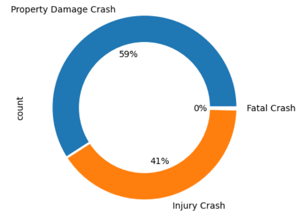
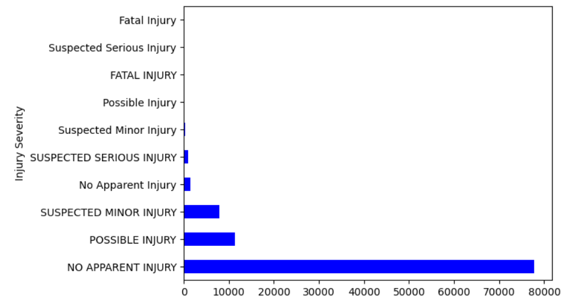
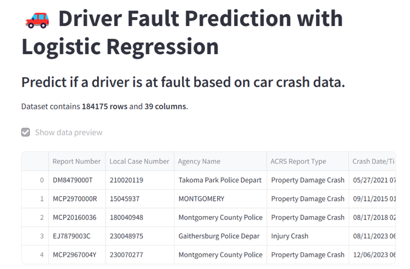

# Driver’s Fault Prediction  
**Prepared for**: UMBC Data Science Master Degree Capstone by Dr. Chaojie (Jay) Wang  
**Author**: Divya Sri Nunety  

- [GitHub Repository](https://github.com/DivyaNunety/UMBC-DATA606-Capstone.git)  
- [LinkedIn Profile](https://www.linkedin.com/in/divyasrinunety/)  
- [PowerPoint Presentation](#)  
- [YouTube Video](https://youtu.be/59Y_Znl0plQ)  

---

## 1. Background  

### What is it About?  
This project aims to predict the severity of road traffic accidents and identify the drivers at fault using machine learning techniques. The dataset obtained from the Automated Crash Reporting System (ACRS) of the Maryland State Police contains detailed records of traffic collisions on county and local roadways within Montgomery County. It includes information about each collision such as the type of vehicles involved, crash conditions, injury severity, and driver details. The project focuses on leveraging data-driven methods to understand the key factors contributing to accident severity and to build predictive models that can classify future accident outcomes and determine fault based on the available data.

### Why Does It Matter?  

- **Accurate predictions**:  
  - Help emergency services allocate resources more effectively.  
  - Ensure faster and more appropriate responses based on accident severity.  

- **Understanding accident factors**:  
  - Can guide **policy changes**.  
  - Inform **infrastructure improvements**.  
  - Support **targeted safety campaigns** to enhance road safety.  

- **Identifying fault**:  
  - Streamlines the **insurance claims process**.  
  - Ensures **fair compensation**.  
  - Reduces **fraud**.  

- **Data-driven insights**:  
  - Enable **government agencies** and **law enforcement** to make informed decisions for **better traffic management**.  
  - Assist in **resource planning**.  

- **Recognizing patterns** in driver faults and accident severity:  
  - Helps implement **targeted interventions** to reduce **human error**.  
  - Contributes to **safer roads** for everyone.  

---

## 2. Research Questions  

1. How does driver behavior (e.g., speeding, distraction, alcohol use) influence the likelihood of being at fault in a traffic collision?  
2. Can real-time data (e.g., weather, traffic flow) improve the accuracy of predictive models for accident severity and fault determination?  
3. What combinations of vehicle-related factors (e.g., vehicle type, age, safety features) are most strongly associated with high-severity accidents?  

---

## 3. Data  

### Data Sources:  
The dataset used in this project is sourced from the Automated Crash Reporting System (ACRS) ([Crash Reporting - Drivers Data](https://catalog.data.gov/dataset/crash-reporting-drivers-data)) maintained by the Maryland State Police.  

### Data Details:  
- **Size**: 82 MB  
- **Shape**:  
  - **Rows**: 157,841  
  - **Columns**: 43  
- **Time Period**: 2006–2024  

### Target Variables for Machine Learning  
- **Crash Severity Prediction**: `Crash_Severity` (1 = Fatal, 2 = Serious, 3 = Minor)  
- **Driver Fault Prediction**: `Driver_Fault` (1 = At Fault, 0 = Not at Fault, -1 = Unknown)  

---

## 4. Data Exploration and Cleaning  

### Overview:  
- **Initial Data Loading**: Dataset loaded using `pandas.read_csv("Drivers_Data.csv")`.  
- **Data Structure**: Analyzed with `.shape()` and `.info()`.  
- **Missing Values**: Rows with missing or irrelevant data were dropped.  

---

## 5. Exploratory Data Analysis (EDA)  

### Visualizations  
- **ACRS Report Types**:  
    

- **Collision Types**:  
    

- **Weather Conditions**:  
    

- **Surface Conditions**:  
    

- **Driver Substance Abuse**:  
    

- **Injury Severity**:  
    

### Correlation Analysis  
- **Heatmap**: Showed relationships between features.  
    

---

## 6. Data Preprocessing  

### Feature Selection:  
Selected features for fault prediction include:  
- **Driver-Related**: Driver Age, Gender, Substance Abuse  
- **Vehicle-Related**: Vehicle Type, Speed Limit  
- **Environmental**: Weather, Surface Conditions  
- **Crash Variables**: Collision Type, Injury Severity  

### Encoding:  
Categorical variables like `Collision Type` and `Weather` were label-encoded.  

---

## 7. Model Building  

### Models:  
1. Logistic Regression (Baseline)  
2. Random Forest  
3. Support Vector Machine (SVM)  

### Evaluation:  
- **Logistic Regression**: 78.77%  
- **Random Forest**: 74.22%  
- **SVM**: 72.06%  

---

## 8. Streamlit Application  

Developed an interactive **Streamlit** application:  
- **Inputs**: Accident-related variables (e.g., Weather, Collision Type).  
- **Output**: Likelihood of driver being at fault.  

  
  

---

## 9. Conclusion  

### Key Findings:  
- Collision type, injury severity, and lighting conditions are significant predictors of fault.  

### Limitations:  
- Lack of real-time factors like traffic flow and weather updates.  

### Future Work:  
- Incorporate external datasets for deeper insights.  
- Experiment with advanced machine learning techniques.  

---

## 10. References  

- Maryland State Police Crash Reporting  
- Python libraries documentation (scikit-learn, pandas, seaborn)  
- Articles on machine learning for accident analysis  

