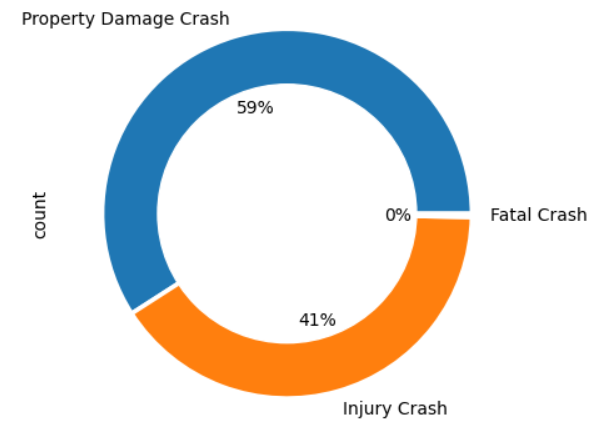
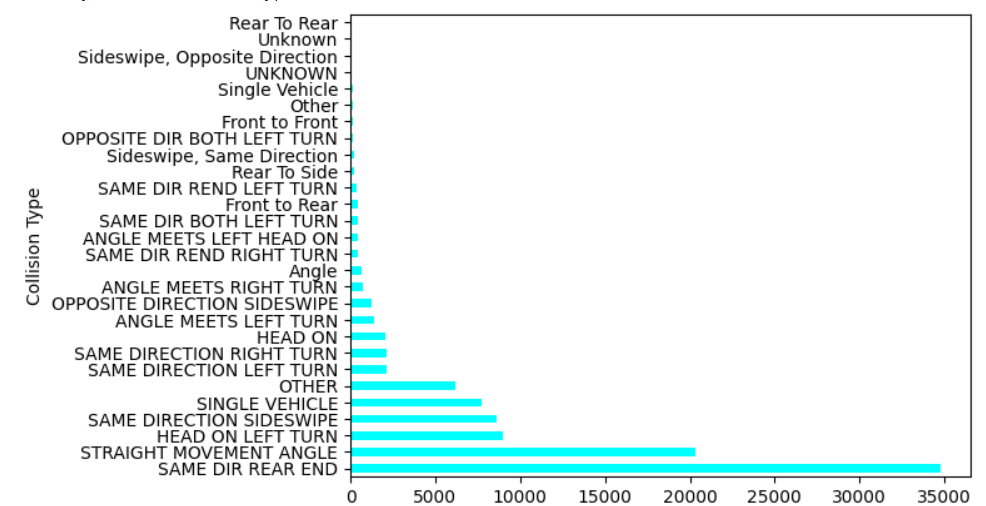
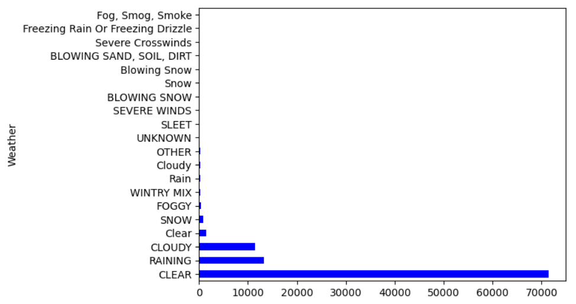
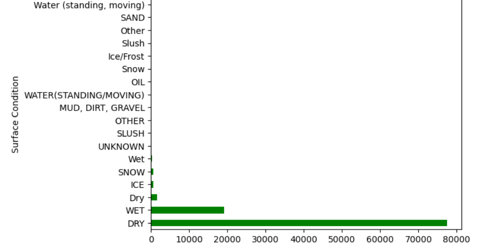
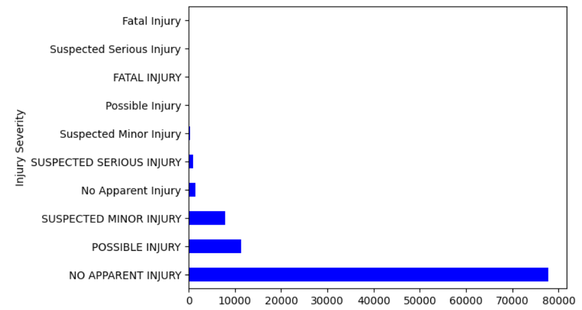
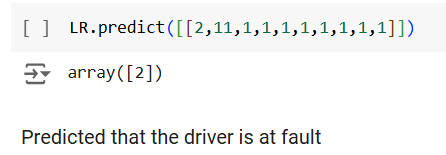
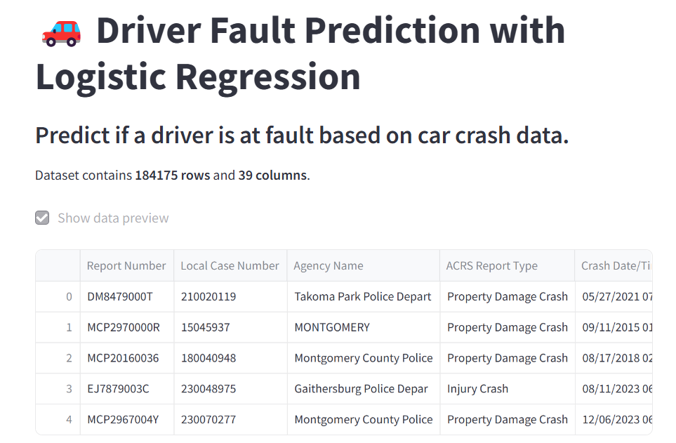
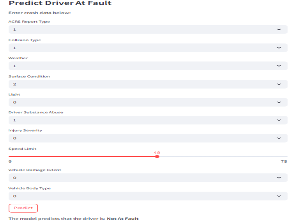

# Project Title: Driver’s Fault Prediction
**Prepared for**: UMBC Data Science Master Degree Capstone by Dr. Chaojie (Jay) Wang  
**Author**: Divya Sri Nunety  

- [GitHub Repository](https://github.com/DivyaNunety/UMBC-DATA606-Capstone.git)  
- [LinkedIn Profile](https://www.linkedin.com/in/divyasrinunety/)
- [PowerPoint Presentation](#)  
- [YouTube Video](#)  

---

**GitHub repo of the project**: [UMBC-DATA606-Capstone](https://github.com/DivyaNunety/UMBC-DATA606-Capstone.git)  
**LinkedIn profile**: [Divya Sri Nunety](https://www.linkedin.com/in/divyasrinunety/)

## Background

### What is it About?
This project aims to predict the severity of road traffic accidents and identify the drivers at fault using machine learning techniques. The dataset obtained from the Automated Crash Reporting System (ACRS) of the Maryland State Police contains detailed records of traffic collisions on county and local roadways within Montgomery County. It includes information about each collision such as the type of vehicles involved, crash conditions, injury severity, and driver details. The project focuses on leveraging data-driven methods to understand the key factors contributing to accident severity and to build predictive models that can classify future accident outcomes and determine fault based on the available data.

### Why Does It Matter?
Here’s the paragraph broken down into key points:

- **Accurate predictions**:
  - Help emergency services allocate resources more effectively.
  - Ensure faster and more appropriate responses based on accident severity.

- **Understanding accident factors**:
  - Can guide **policy changes**.
  - Inform **infrastructure improvements**.
  - Support **targeted safety campaigns** to enhance road safety.

- **Identifying fault**:
  - Streamlines the **insurance claims process**.
  - Ensures **fair compensation**.
  - Reduces **fraud**.

- **Data-driven insights**:
  - Enable **government agencies** and **law enforcement** to make informed decisions for **better traffic management**.
  - Assist in **resource planning**.

- **Recognizing patterns** in driver faults and accident severity:
  - Helps implement **targeted interventions** to reduce **human error**.
  - Contributes to **safer roads** for everyone.
## Research Questions
1. How does driver behavior (e.g., speeding, distraction, alcohol use) influence the likelihood of being at fault in a traffic collision?
2. Can real-time data (e.g., weather, traffic flow) improve the accuracy of predictive models for accident severity and fault determination?
3. What combinations of vehicle-related factors (e.g., vehicle type, age, safety features) are most strongly associated with high-severity accidents?

## Data 

### Data Sources:
The dataset used in this project is sourced from the Automated Crash Reporting System (ACRS) ([Crash Reporting - Drivers Data](https://catalog.data.gov/dataset/crash-reporting-drivers-data)) maintained by the Maryland State Police, with collision data reported by Montgomery County Police, Gaithersburg Police, Rockville Police, and Maryland-National Capital Park Police. It includes detailed records of traffic collisions on county and local roadways.

### Data Size:
      82 MB

### Data Shape:
- **Rows**: 157,841
- **Columns**: 43

### Time Period:
    2006-2024

### Each Row Represent
Each row represents a motor vehicle operator (driver) involved in a traffic collision on a county or local roadway in Montgomery County. Each entry includes driver, vehicle, and accident details as well as severity and fault data.

## Data Dictionary

| Column Name              | Data Type | Definition                                                  | Potential Values                          |
|--------------------------|-----------|--------------------------------------------------------------|-------------------------------------------|
| Crash_ID                  | String    | Unique identifier for each reported crash.                    | Alphanumeric string (e.g., "ACRS202301")  |
| Crash_Date                | Date      | Date of the collision.                                        | Date format (e.g., "2023-01-15")          |
| Driver_ID                 | String    | Unique identifier for each driver involved in the crash.       | Alphanumeric string                       |
| Driver_Age                | Integer   | Age of the driver.                                            | Numeric value (e.g., 25, -1 for unknown)  |
| Driver_Gender             | Integer   | Gender of the driver.                                         | 1 = Male, 2 = Female, -1 = Unknown        |
| Vehicle_Type              | Integer   | Type of vehicle involved in the collision.                    | 1 = Car, 2 = Truck, 3 = Motorcycle, etc.  |
| Road_Condition            | Integer   | Road conditions at the time of the crash.                     | 1 = Dry, 2 = Wet, 3 = Snow/Ice, etc.      |
| Crash_Severity            | Integer   | Severity of the crash.                                        | 1 = Fatal, 2 = Serious, 3 = Minor         |
| Driver_Fault              | Integer   | Whether the driver was at fault.                              | 1 = At Fault, 0 = Not at Fault, -1 = Unknown |
| Weather_Condition         | Integer   | Weather conditions during the crash.                          | 1 = Clear, 2 = Rain, 3 = Fog, etc.        |
| Speed_Limit               | Integer   | Speed limit on the road where the crash occurred.              | Numeric value (e.g., 30, 45, etc.)        |
| Collision_Type            | Integer   | Type of collision (e.g., rear-end, head-on).                  | 1 = Rear-End, 2 = Head-On, 3 = Side-Swipe, etc. |
| Injury_Severity           | Integer   | Severity of injuries sustained by the driver or passengers.    | 1 = Fatal, 2 = Serious, 3 = Slight        |
| Light_Condition           | Integer   | Lighting conditions at the time of the crash.                 | 1 = Daylight, 2 = Dark - Street Lights On, etc. |
| Alcohol_Involved          | Integer   | Whether alcohol was involved in the crash.                    | 0 = No, 1 = Yes                           |
| Distraction_Involved      | Integer   | Whether distraction was involved in the crash.                | 0 = No, 1 = Yes                           |
| Driver_Education_Level    | Integer   | Education level of the driver.                                | 1 = High School, 2 = College, etc.        |
| Emergency_Response_Time   | Integer   | Time taken for emergency responders to arrive at the scene.    | Numeric value (e.g., 5, 15, etc.)         |

### Target Variable for Machine Learning
- **For Severity Prediction**: The target variable is `Crash_Severity`, representing the severity of the collision, categorized into:
  - 1 = Fatal
  - 2 = Serious
  - 3 = Minor

- **For Driver Fault Prediction**: The target variable is `Driver_Fault`, representing whether the driver was responsible for the accident:
  - 1 = At Fault
  - 0 = Not at Fault
  - -1 = Unknown

### Potential Features/Predictors for Machine Learning Models
- **Driver-Related Variables**:
  - Driver_Age
  - Driver_Gender
  - Driver_Education_Level
  - Alcohol_Involved
  - Distraction_Involved

- **Vehicle-Related Variables**:
  - Vehicle_Type
  - Speed_Limit
  - Collision_Type

- **Environmental Variables**:
  - Weather_Condition
  - Road_Condition
  - Light_Condition

- **Crash Variables**:
  - Emergency_Response_Time
  - Injury_Severity
  - Time_of_Day
## **Data Exploration and Cleaning**

### **Dataset Overview**
The dataset consists of various features related to car crashes, including:
- **Crash Details**: `ACRS Report Type`, `Collision Type`, `Weather`, `Surface Condition`, `Light Condition`, etc.
- **Driver and Vehicle Information**: `Driver Substance Abuse`, `Vehicle Body Type`, `Driver At Fault`.

#### Key actions:
- **Initial Data Loading**: I loaded the dataset using `pandas.read_csv("Drivers_Data.csv")`.
- **Data Structure**: I used `.shape()` and `.info()` to assess the dataset’s structure, including the number of rows and columns.
- **Handling Missing Values**: I identified missing data in several columns and dropped irrelevant or redundant columns (`Report Number`, `Municipality`, `Related Non-Motorist`, etc.).
- **Dropping Rows with Missing Values**: I dropped the rows containing missing values, which left me with only complete data for further analysis.

---

## **Exploratory Data Analysis (EDA)**

### **Visualization of Categorical Variables**
To explore key categorical features, I created visualizations to understand patterns in the data:
#### **Distribution of ACRS Report Types**
Number of different type of report when filed after car crash: 3

  

### **Frequency of Different Collision Types**
Number of unique collision types: 3
Although I initially observed 3 unique collision types, the graph displayed more types, possibly due to additional categories or mislabeled data. After resolving this, I gained a clear understanding of the types of collisions that occur most frequently.

  

### **Distribution of Weather Conditions**
Different Weather conditions: 20

  

### **Distribution of Surface Conditions**
Different Surface conditions: 18

  

### **Role of Driver Substance Abuse in Crashes**
Driver Substance Abuse while he was driving: 18

  

### **Injury Severity Analysis**
Different Injury Severity conditions: 10
By analyzing `Injury Severity` vs. `Vehicle Body Type` with scatter plots, I discovered potential relationships between vehicle type and injury severity, which are important for predicting crash outcomes.

  

### **Correlation Analysis**
I computed a correlation matrix to identify relationships between numeric variables:
- **Heatmap**: I used a heatmap to visualize the correlations between features such as `Injury Severity`, `Speed Limit`, and `Vehicle Damage Extent`, helping me understand how these features interact.

  
*Correlation Heatmap of Features*

#### Insights:
- There is likely a degree of correlation between `Injury Severity` and `Vehicle Damage Extent`, as well as between `Speed Limit` and other factors.
- I noticed that external factors like **Weather** and **Light Conditions** might have lower correlations with driver fault, as these are environmental conditions not necessarily tied to driver behavior.

---

## **Data Preprocessing**

### **Feature Selection**
I selected a subset of columns that I believed would impact the prediction of whether the driver was at fault. These include:
- **Selected Features**: `ACRS Report Type`, `Collision Type`, `Weather`, `Surface Condition`, `Light`, `Driver Substance Abuse`, `Injury Severity`, `Speed Limit`, `Vehicle Damage Extent`, `Vehicle Body Type`.
- **Target Variable**: I encoded the `Driver At Fault` column into `Driver_At_Fault_encoded` using `LabelEncoder`.

#### Insights:
I chose features that cover a broad range of factors related to crashes. However, I plan to explore other features or engineer new ones (e.g., `Time of Day`, `Road Type`) to potentially improve model performance.

### **Encoding Categorical Variables**
I applied `LabelEncoder` to convert categorical variables like `Collision Type`, `Weather`, and `Injury Severity` into numeric format for use in the machine learning model.

#### Insights:
While **label encoding** is useful for this classification task, I could explore **one-hot encoding** for some features, especially those without ordinal relationships, such as `Collision Type` and `Weather`.

---

## **Model Building** 
### Models  
- Logistic Regression (Baseline)  
- Random Forest  
- Support Vector Machine (SVM)

---

### **Model Training and Testing**
### Training Process  
- Data split: 80% for training, 20% for testing.  
- Cross-validation: 10-fold CV to ensure reliability. 

### Development Tools  
- **Python Libraries**: `scikit-learn`, `pandas`, `numpy`, `matplotlib`, `seaborn`.  
- **Environment**: Google Colab, Juypter.
  
---

### **Model Evaluation**
**Accuracy**: 
- **Logistic Regression**: 78.77%
- **Random Forest**: 74.22%
- **Support Vector Machine**: 72.06%

  Prediction Accuracy: With tuning, the Logistic Regression model achieved a prediction accuracy of 75%, making it a reliable tool for identifying driver fault in   accident scenarios.

  Example Prediction: For an accident with adverse weather, high injury severity, and substance abuse by the driver, the model would likely predict 'At Fault'.

  
---

## Application of the Trained Models  
Developed an interactive **Streamlit** application:  
- Inputs: Accident-related variables (e.g., Weather, Collision Type).  
- Output: Likelihood of the driver being at fault.  
- Features: Easy-to-use interface for public and policymakers.  

  
---

## 6. Conclusion  
### Key Findings  
- Collision type, injury severity, and lighting conditions are significant predictors of fault.  
- Logistic Regression provided interpretable results with high accuracy.  

### Limitations  
- Limited variables: The dataset lacks real-time factors like traffic flow and weather updates.  
- No temporal or spatial modeling for location-specific insights.  

### Future Work  
- Incorporate external datasets (e.g., Census data, real-time traffic/weather).  
- Experiment with neural networks for deeper insights.  

---
