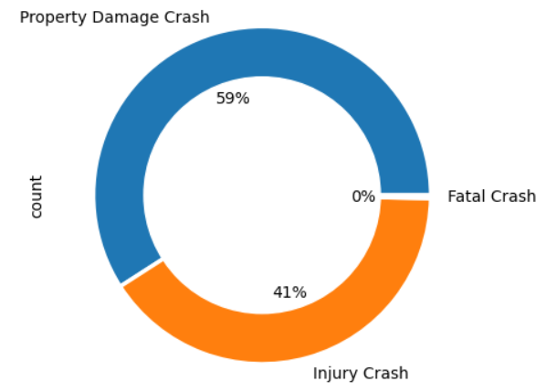
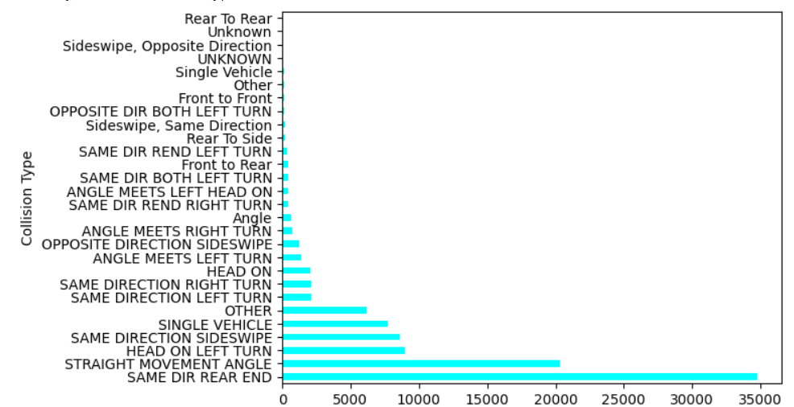
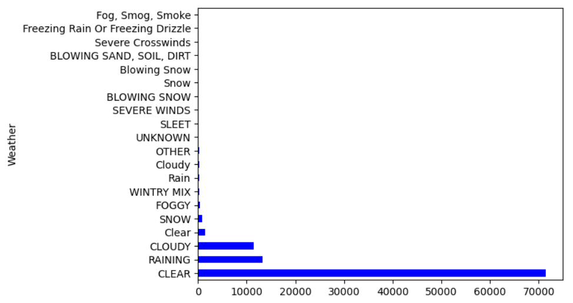
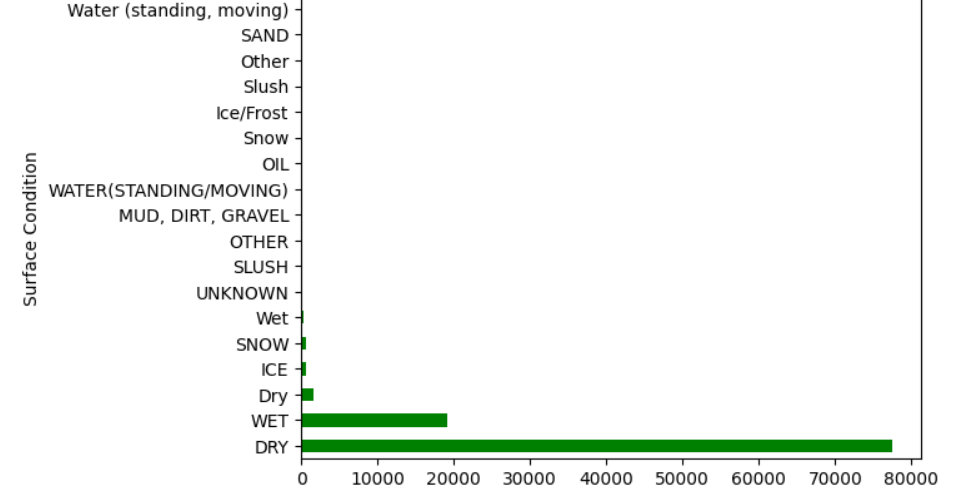
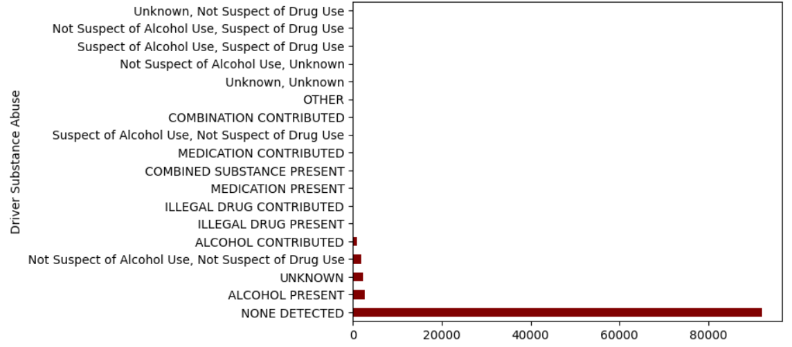
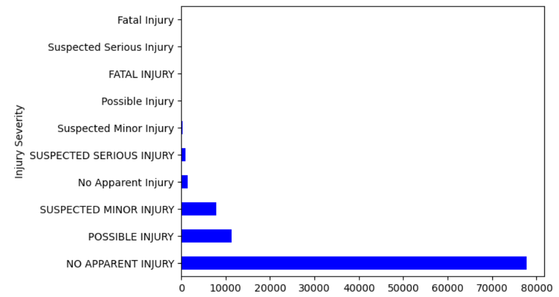
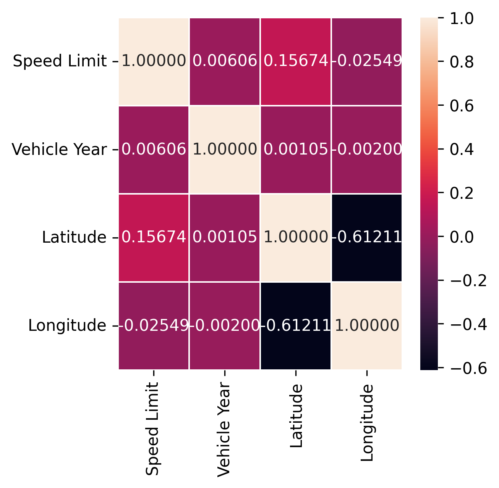

# **Title**: Driver’s Fault Prediction 

## **Project Overview**
The goal of my project is to analyze car crash data, identify key patterns related to crashes, and predict whether the driver was at fault using machine learning techniques. I employed data preprocessing, exploratory data analysis (EDA), and logistic regression for prediction.

---

## **1. Data Exploration and Cleaning**

### **1.1 Dataset Overview**
The dataset consists of various features related to car crashes, including:
- **Crash Details**: `ACRS Report Type`, `Collision Type`, `Weather`, `Surface Condition`, `Light Condition`, etc.
- **Driver and Vehicle Information**: `Driver Substance Abuse`, `Vehicle Body Type`, `Driver At Fault`.

#### Key actions:
- **Initial Data Loading**: I loaded the dataset using `pandas.read_csv("Drivers_Data.csv")`.
- **Data Structure**: I used `.shape()` and `.info()` to assess the dataset’s structure, including the number of rows and columns.
- **Handling Missing Values**: I identified missing data in several columns and dropped irrelevant or redundant columns (`Report Number`, `Municipality`, `Related Non-Motorist`, etc.).
- **Dropping Rows with Missing Values**: I dropped the rows containing missing values, which left me with only complete data for further analysis.

#### Insights:
The dataset is relatively clean after removing missing values, but I recognize that dropping entire rows may have resulted in a loss of valuable data. In future iterations, I might consider imputing missing values instead of dropping them, especially for key features.

---

## **2. Exploratory Data Analysis (EDA)**

### **2.1 Visualization of Categorical Variables**
To explore key categorical features, I created visualizations to understand patterns in the data:
#### *Distribution of ACRS Report Types*

  

### *Frequency of Different Collision Types*

  

### *Distribution of Weather Conditions*

  

### *Distribution of Surface Conditions*

  

### *Role of Driver Substance Abuse in Crashes*

  

### *Injury Severity Analysis*

  

#### Insights:
- **Collision Types**: Although I initially observed 3 unique collision types, the graph displayed more types, possibly due to additional categories or mislabeled data. After resolving this, I gained a clear understanding of the types of collisions that occur most frequently.
- **Injury Severity**: By analyzing `Injury Severity` vs. `Vehicle Body Type` with scatter plots, I discovered potential relationships between vehicle type and injury severity, which are important for predicting crash outcomes.

### **2.2 Correlation Analysis**
I computed a correlation matrix to identify relationships between numeric variables:
- **Heatmap**: I used a heatmap to visualize the correlations between features such as `Injury Severity`, `Speed Limit`, and `Vehicle Damage Extent`, helping me understand how these features interact.

  
*Correlation Heatmap of Features*

#### Insights:
- There is likely a degree of correlation between `Injury Severity` and `Vehicle Damage Extent`, as well as between `Speed Limit` and other factors.
- I noticed that external factors like **Weather** and **Light Conditions** might have lower correlations with driver fault, as these are environmental conditions not necessarily tied to driver behavior.

---

## **3. Data Preprocessing**

### **3.1 Feature Selection**
I selected a subset of columns that I believed would impact the prediction of whether the driver was at fault. These include:
- **Selected Features**: `ACRS Report Type`, `Collision Type`, `Weather`, `Surface Condition`, `Light`, `Driver Substance Abuse`, `Injury Severity`, `Speed Limit`, `Vehicle Damage Extent`, `Vehicle Body Type`.
- **Target Variable**: I encoded the `Driver At Fault` column into `Driver_At_Fault_encoded` using `LabelEncoder`.

#### Insights:
I chose features that cover a broad range of factors related to crashes. However, I plan to explore other features or engineer new ones (e.g., `Time of Day`, `Road Type`) to potentially improve model performance.

### **3.2 Encoding Categorical Variables**
I applied `LabelEncoder` to convert categorical variables like `Collision Type`, `Weather`, and `Injury Severity` into numeric format for use in the machine learning model.

#### Insights:
While **label encoding** is useful for this classification task, I could explore **one-hot encoding** for some features, especially those without ordinal relationships, such as `Collision Type` and `Weather`.

---

## **4. Model Building**

### **4.1 Logistic Regression**
- **Model Choice**: I selected logistic regression, as it is suitable for binary classification tasks such as predicting whether the driver was at fault.
- **Feature and Target Split**: I split the dataset into a feature matrix `X` (independent variables) and the target variable `Y` (`Driver_At_Fault_encoded`).
- **Train-Test Split**: I used an 80-20 split to divide the data into training and test sets (`train_test_split`).

#### Insights:
Logistic regression is a good baseline model because of its simplicity and interpretability. However, it may not capture complex relationships between variables, which a non-linear model might handle better.

### **4.2 Model Training and Testing**
I trained the logistic regression model using the training set (`X_train`, `Y_train`). After fitting the model, I used it to predict on the test set (`X_test`) and generated a **classification report** to evaluate the performance.

#### Insights:
The logistic regression model provided an accuracy of **56%**, which indicates that there is room for improvement. I plan to enhance the model by tuning hyperparameters and trying alternative algorithms to increase this accuracy in the coming weeks.

### **4.3 Model Evaluation**
- **Accuracy**: The model achieved an accuracy of **56%**, which is a starting point for predicting driver fault.
- **Precision, Recall, and F1-Score**: The classification report included these metrics, which helped me understand the trade-off between false positives and false negatives.

#### Insights:
The logistic regression model works well for simple relationships between features and the target. Given the accuracy of 56%, I believe the model can be improved by refining feature selection and exploring more complex models.

---

## **5. Conclusion and Recommendations**

### **5.1 Summary**
I successfully analyzed and predicted driver fault in car crashes using logistic regression. My exploratory data analysis provided valuable insights into how factors like collision type, weather, and injury severity relate to crash outcomes. The logistic regression model achieved an accuracy of **56%**, which serves as a baseline.

### **5.2 Recommendations for Improvement**
1. **Data Imputation**: Instead of dropping rows with missing values, I should explore imputing missing data to retain more information.
2. **Feature Engineering**: I could create new features, such as `Time of Day`, `Road Type`, or interactions between existing features, to better capture complex relationships.
3. **Model Optimization**: I plan to use **GridSearchCV** to tune hyperparameters or explore alternative algorithms like **Random Forests**, **Support Vector Machines (SVMs)**, or **XGBoost** to improve the accuracy in the coming weeks.
4. **Evaluation Metrics**: I should evaluate the model using additional metrics, such as the **ROC curve** and **AUC score**, to get a clearer understanding of the model's performance in distinguishing between classes.

---

### **6. Final Remarks**
This project has given me a solid understanding of data science and machine learning concepts, from data cleaning and exploration to model building and evaluation. While the current model achieves 56% accuracy, I plan to make further improvements by exploring more complex models and enhancing feature selection, with the goal of increasing accuracy in the coming weeks.
